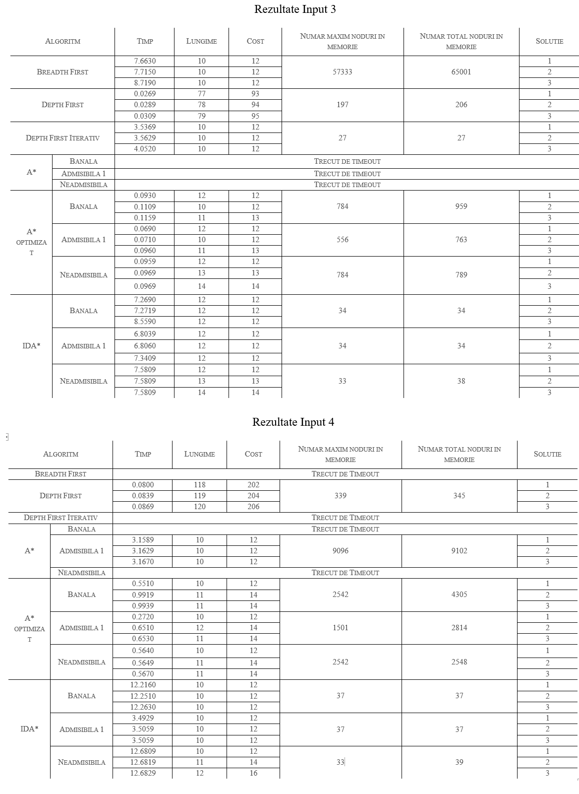

# Inteligenta Artificiala - Klotski
## Cerinta
Considerăm că avem o cutie cu piese de diverse forme (nu neapărat dreptunghiulare), și niște locuri libere. Printre piese e și o piesă specială pe care dorim să o scoatem din cutie. Cutia are o ramă (bordură) cu o ieșire. Dorim să mutăm piesele în stânga, dreapta, sus sau jos, evident, doar dacă au loc, astfel încât, după mutări sucesive să putem scoate piesa specială din cutie. Piesa specială e singura care poate ieși complet. Celelate piese se pot deplasa doar până în spațiul liber din bordură (inclusiv) dar nu pot depăși acel spațiu nici măcar cu un fragment.
## Stări și tranziții
O stare reprezintă o așezare a pieselor la un moment dat.
O tranziție e mutarea unei singure piese
## Costul
Costul e dat de căt de mare este piesa mutată (numărul de celule pe care îl ocupă în matrice. Excepție face piesa specială pentru care costul unei mutări este 1.
## Fisierul de intrare
Fișierul de intrare va conține o reprezentare a cutiei sub forma unei matrici.
Simbolurile din matrice sunt:
* "#" pentru bordură
* litere sau cifre pentru piese. Un grup de litere identice formează o singură piesă, nu avem voie să avem mai multe piese cu aceeași literă.
* "." pentru spațiile libere.
* "*" pentru piesa specială.
## Fișier output
În fișierul de ieșire se vor afișa configurațiile succesive, precizând între fiecare două configurații ce piesă s-a mutat și în ce direcție.

Ultima configurație va conține piesa scoasă. 
## Mod apelare program
Pentru a apela programul din linia de comanda, se va utiliza o comanda cu patternul:
> python main.py \<Path input\> \<Path output\> \<Numar solutii cautate\> \<Timeout functii (in secunde)\>

Exemple:
> python main.py input_folder output_folder 1 10 <- Va cauta o solutie, in maxim 10 secunde

> python main.py input_folder output_folder 5 30 <- Va cauta 5 solutii, in maxim 30 de secunde

## Euristici
### Euristica Admisibila 1
Prima euristica admisibila se bazeaza pe distanta Manhattan. Vom cauta in starea curenta toate pozitiile unde se afla bucati din piesa speciala. Pentru fiecare din acestea, vom calcula distanta minima manhattan de la aceasta la o iesire. La final, h va fi egal cu media dintre minime. Nu exista niciun caz in care h-ul obtinut sa fie mai mare decat costul minim de aflare al unei solutii deoarece in cel mai bun caz acestea sunt egale, in orice alt caz, piesa este blocata de alte piese si necesita miscari suplimentare.
### Euristica neadmisibila
Euristica neadmisibila calculeaza numarul de mutari maxim ce ar putea fi facut pentru fiecare bucata din piesa speciala pentru a asigura faptul ca iese din puzzle. Este neadmisibila deoarece bucata speciala va muta in cost 1 toate bucatiile sale individuale, suma anterioara fiind in majoritatea cazurilor mai mare decat h-ul real. In cel mai favorabil caz, piesa sepciala este formata dintr-o singura bucata si merge pe un drum de latime 1, caz in care valoarea va fi egala cu cea a drumului minim.
## Tabel Rezultate

